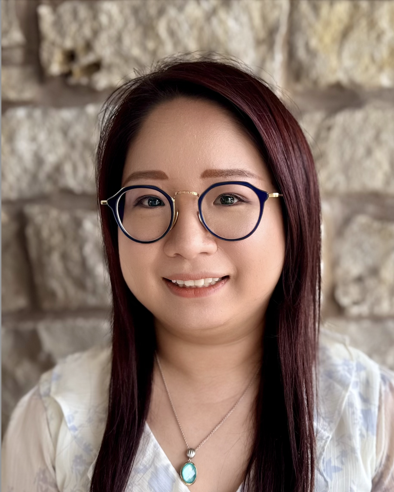

# Welcome to My Portfolio

# About Me
Hi, I'm Shan Durgut, an RF localization and sensor fusion engineer. I design cutting-edge indoor tracking systems that merge data from Ultra-Wideband and Bluetooth sensors using advanced AI models. Recently, I developed a hybrid solution that uses a combination of LSTM and CNN architectures to fuse UWB and BLE data, achieving real-time, high-precision positioning in challenging environments. This approach can significantly enhance applications in smart buildings, robotics, and asset tracking. I’m passionate about leveraging these technologies to solve real-world problems.
### Current Goals
I am dedicated to continuous professional growth. I am a highly motivated self-learner with a strong background in RF engineering, wireless communication, sensor fusion, machine learning. Over the past few years, I have independently pursued online courses certificates and advanced technical projects—including developing an RF localization system using UWB and BLE sensor fusion techniques—to stay at the forefront of emerging technologies. Balancing this commitment with raising two children has honed my time management, adaptability, and problem-solving skills. I am now eager to leverage my self-driven expertise and fresh, innovative insights as I transition back into the industry and contribute to impactful, forward-thinking projects.

## Experience
### Previous Roles
### McKesson-Change Healthcare | Dubuque, IA | Aug. 2017 - Aug. 2018
#### Quality Assurance Engineer
- Support daily Production Maintenance Requests and update database Payor information values.
- Tested Web-based Support Tools that narrows search of Submitter, Biller amidst large amount of data.
- Database Bulk-load testing, change all values of certain fields at once by using sample data.
- Created Gherkins and documentation for test projects.
- Recorded Test Processes in the Application Life Cycle Managements.
- Monitored the Volume Testing (Processing substantial number of claims) and sent out Volume Report.

### The University of Iowa | Iowa City, IA |Aug. 2015 - Dec. 2015
#### Teaching Assistant
- Assisted in organizing course material and mentored students.

### The University of Iowa | Iowa City, IA | Dec. 2013 - Feb. 2014
#### Diversity Ambassador
- Studied international finance and published article on school website.

### The University of Iowa Law Library | Iowa City, IA | Summer 2013
#### Librarian Assistant
- Organized and updated the law volumes by inserting new chapters or removing outdated chapters. Provided services for helping people to find what they need.

## Skills

- Skill Category 1
  - Skill 1
  - Skill 2
  - Skill 3

- Skill Category 2
  - Skill 1
  - Skill 2
  - Skill 3

## Education

- **Degree** - University of Iowa (Computer Science)
  

# Get in Touch

Feel free to reach out to me through any of the following channels:

- Email: shanshan.durgut@gmail.com
- LinkedIn: Shan Durgut, https://www.linkedin.com/in/shanshanhuang-miray
- GitHub: Shan Durgut, https://shansdurgut.github.io/ShanDurgut

  

  

